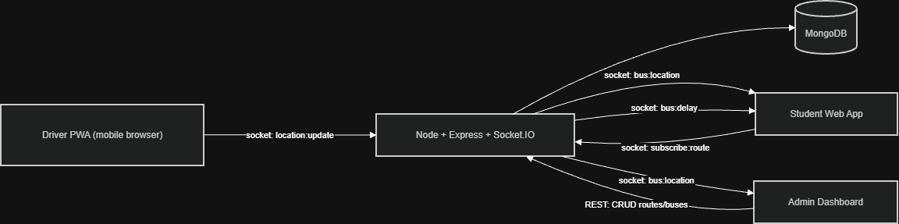
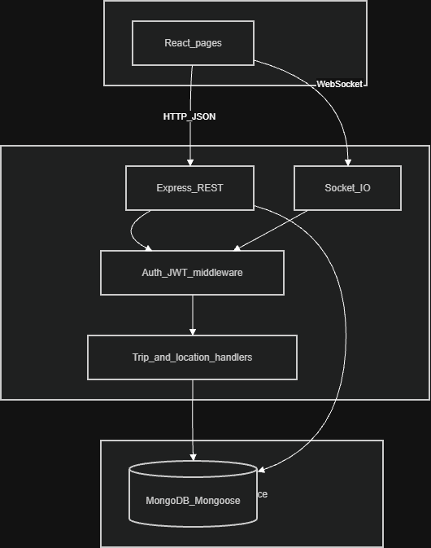
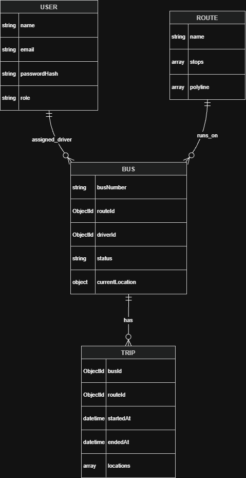
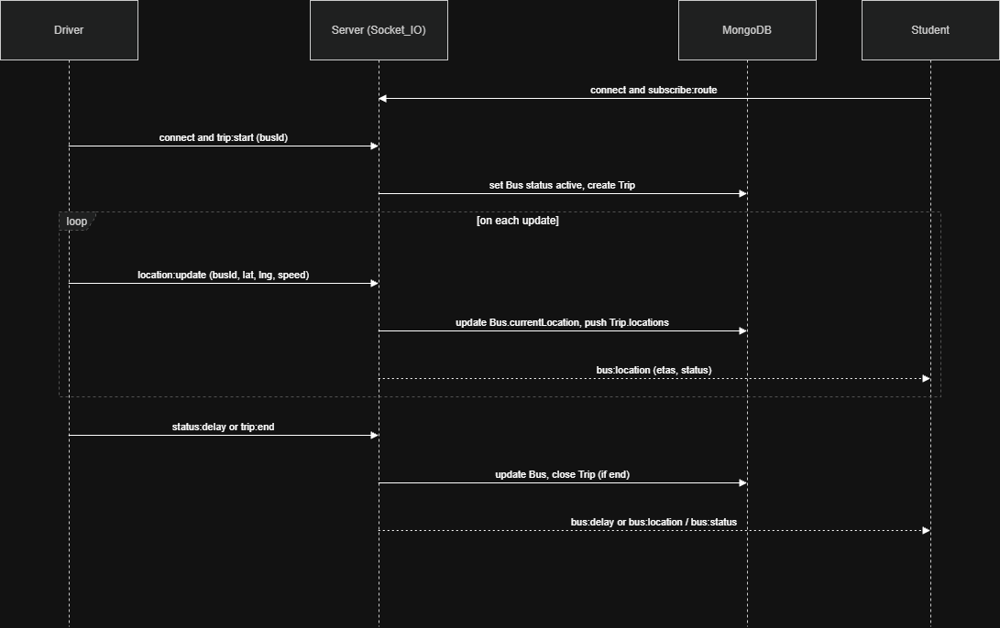

# High-Level Design — Campus Bus Tracking System

This document describes the problem, users, architecture, data model, key real-time flows, and security. 
---

## 1. Problem

Students rely on campus buses but lack reliable visibility into where buses are and when they will reach the next stop. The system provides **real-time** bus positions on a map, **per-stop ETAs**, and **delay notifications** (driver-flagged or inferred from missing updates). Administrators need tools to **manage** routes, buses, and drivers and to **monitor** live operations from one place.

## 2. Users and goals

| Role    | Goals |
| ------- | ----- |
| Student | See live bus location, ETAs to upcoming stops, receive delay alerts |
| Driver  | Start/end trip, share real or **simulated** GPS, flag delays (mobile browser) |
| Admin   | CRUD routes, buses, drivers; monitor all active buses on a map |

## 3. System context (C4-style)

Who uses the app, the product boundary, persistence, and the external map tiles provider.

- **OSM / Leaflet:** the browser loads map tiles from public OpenStreetMap servers; no map API key in the app.

## 4. High-level architecture

Single Node process: **HTTP** for auth and admin APIs; **WebSockets** (Socket.IO) for live location and broadcasts. Clients use **rooms** (e.g. one room per route) so updates fan out only to interested users.

- **REST** — register/login, `Authorization: Bearer` JWT, CRUD and lists for admin resources.
- **Socket.IO** — `subscribe:route` / `subscribe:all` (admin), `trip:start` / `trip:end`, `location:update`, `status:delay`; server emits `bus:location`, `bus:delay`, `bus:status`, `error`.

## 5. Logical layers

How **REST** and **WebSocket** traffic pass through the same server and where auth applies.

- **Auth** — JWT in `Authorization` for REST; Socket.IO handshake passes `auth.token` and is verified in `io.use` before any event handler.

## 6. Data model (ERD)

- **Indexes** (recommended in production): `User.email` (unique), `Bus.routeId`, `Trip.busId`.

## 7. Key sequence: driver to student (live tracking)

## 8. ETA and delay logic

- **ETA** — from current bus position to upcoming stops: distance (e.g. haversine) and assumed average speed. Default bus speed is configurable via **`AVG_BUS_SPEED_KMH`** (default **25** km/h in [config.js](../backend/src/config.js)). Recomputed on each `location:update` and sent in the socket payload as `etas: [{ stopId, sec? }]`.
- **Delay** — if a driver calls **`status:delay`**, the bus is marked `delayed` and `bus:delay` is broadcast. If the bus is **active** and more than **30 s** pass since the last `currentLocation.updatedAt` on a new `location:update`, the system may set status to delayed and emit a delay (see `DELAY_THRESHOLD_MS` in [sockets/index.js](../backend/src/sockets/index.js)).

## 9. Security

- **Passwords** — `bcryptjs` (hash at rest, never return raw password).
- **JWT** — signed with `JWT_SECRET`, expiry (e.g. 7d via `JWT_EXPIRES`).
- **REST** — `Authorization: Bearer <token>`; route handlers check **role** (`student` | `driver` | `admin`) where required.
- **Socket.IO** — `auth.token` in the handshake; invalid/missing token rejects the connection. Driver-only and admin-only events check `socket.user.role` on the server.

## 10. Non-functional notes

- **Scalability** — route rooms (`route:<id>`) limit broadcast size; horizontal scaling of Node + Socket.IO needs **sticky sessions** at the load balancer.
- **Stateless API** — REST is stateless; real-time state is in process memory and DB. Multiple Node instances need shared session affinity for the same client connection.
- **Demo / lab** — driver **simulated** path along route polyline when GPS is unavailable.

## 11. Technology stack (rationale)

| Area | Choice | Why |
| ---- | ------ | --- |
| App | MERN (Mongo, Express, React, Node) | One language, fast iteration, strong libraries |
| Real-time | Socket.IO | Rooms, reconnect, browser support |
| Maps | Leaflet + OSM | No key, works offline in browser cache for tiles |
| Data | MongoDB + Mongoose | Flexible documents for polylines and location history |
| Test | Jest + Supertest + memory Mongo; Vitest (frontend) | API and socket integration, UI smoke tests |
| CI | GitHub Actions | `npm test` in `backend` and `frontend` on push/PR |

## 12. Testing strategy (summary)

- **Unit** — e.g. ETA math, route simulator, auth helpers, model validation.
- **Integration** — Supertest for HTTP; `socket.io-client` + in-memory server for driver/student room broadcasts.
- **Frontend** — Vitest + Testing Library for login, API helpers, role-gated routes.
- Run: `cd backend && npm test`, `cd frontend && npm test -- --run`.

## Related documentation

- [API.md](API.md) — REST and Socket event contracts
- [DEMO.md](DEMO.md) — in-class demo and test commands
